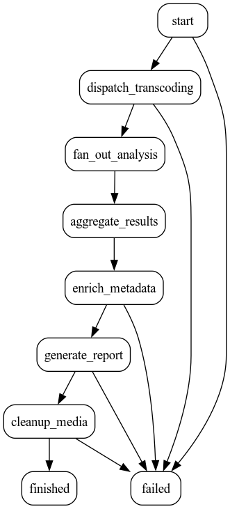
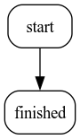

# Avtomatika: Full Feature Showcase (Полная демонстрация возможностей)

[EN](./README.md) | [ES](./README_ES.md) | RU

Этот проект представляет собой всестороннюю демонстрацию экосистемы **Avtomatika HLN (Hierarchical Logic Network)**. Он служит «золотым стандартом» для сквозного (E2E) тестирования, охватывая все архитектурные паттерны и продвинутые функции воркеров.

## 🏗 Архитектура системы

Пример разворачивает полноценную распределенную среду:



1.  **Оркестратор**: Центральный движок, управляющий сложными процессами с вложенными подзадачами. Пакет `avtomatika` из PyPI.
2.  **GPU Воркер**: Демонстрирует «тяжелые» задачи с **отчетами о прогрессе**, **таргетингом по артефактам** и **автоматической загрузкой файлов в S3**. Пакет `avtomatika-worker`.
3.  **CPU Воркеры**: Два исполнителя для параллельного анализа (один надежный, другой нестабильный для тестирования системы репутации).
4.  **Webhook Receiver**: Внешний сервис для получения уведомлений о статусе задач в реальном времени.
5.  **Инфраструктура**: Redis (состояние), PostgreSQL (история), MinIO (S3), VictoriaMetrics, Grafana и Jaeger.

## 🌟 Демонстрация продвинутых возможностей

Этот пример покрывает 100% основного функционала **Avtomatika HLN**:

### 1. Надежная диспетчеризация (ZSET Индексация)
Обнаружение воркеров работает через Redis **Sorted Sets (ZSET)**. Таймштампы используются в качестве скора, что позволяет оркестратору атомарно отфильтровывать устаревшие узлы. Это исключает гонки состояний "data missing".

### 2. Надежный Work Stealing
Свободные воркеры могут «красть» задачи из очередей занятых узлов для максимальной утилизации. Система гарантирует атомарное обновление `assigned_worker_id`.

### 3. Human-in-the-Loop (Участие человека)
Интеграция `actions.await_human_approval()`. Пайплайн приостанавливается на старте, переходя в статус `waiting_for_human` до получения внешнего решения `APPROVED` через API v1.

### 4. Умное распределение задач
*   **Ресурсные ограничения**: Задачи, требующие специфического CPU/RAM (логика GE - Greater or Equal).
*   **Таргетинг по артефактам**: Использование `installed_artifacts` для выбора воркеров, у которых уже установлены нужные компоненты (например, AI-модели или пресеты).
*   **Лимиты по стоимости**: Ограничение задач воркерами в пределах диапазона `max_cost`.
*   **Таймауты**: Тонкий контроль `dispatch_timeout` и `result_timeout`.

### 5. Расширенное взаимодействие с воркерами
*   **Прогресс в реальном времени**: Воркеры отправляют `send_progress(0.33, "Обработка...")`, видимый через API/WS.
*   **Кастомные события воркера**: Эмиссия бизнес- или аппаратных событий (например, `gpu_thermal_status`) во время выполнения задачи.
*   **TaskFiles и S3**: Автоматическая синхронизация. Если воркер возвращает путь к файлу, созданному через `TaskFiles`, SDK автоматически выгружает его в S3.

### 6. Zero-Trust Security (v1.0b26)
*   **mTLS и STS**: Поддержка взаимной аутентификации (mTLS) и автоматической ротации токенов доступа через Security Token Service.
*   **Криптографические подписи**: Каждое сообщение подписано HMAC-SHA256.
*   **Identity Chain**: Проверка всей цепочки идентичности во избежание подделки событий.
*   **Защита от повторов**: Replay protection через обязательные таймштампы.

### 7. Современный синтаксис блюпринтов
*   **Условная маршрутизация**: Использование декораторов `.when("condition")` для декларативного ветвления.
*   **Неявные имена**: Имена состояний автоматически выводятся из названий функций.
*   **Параллелизм**: Простой `fan-out / fan-in` через `actions.dispatch_parallel()` с поддержкой индивидуальных транзитов.

## 🚀 Быстрый старт

### 1. Запуск через Docker (Весь стек)
```bash
docker compose up -d --build
```

### 2. Запуск полной автоматизированной проверки
Выполняет глубокий аудит (линтинг, графики, выполнение сценария с эмуляцией одобрения человеком, проверка S3 и метрик):
```bash
make full-check
```

### 3. Интерактивный демонстрационный клиент
```bash
make init
.venv/bin/python3 client.py
```

## 📂 Структура проекта

*   `blueprints/main.py`: Сложный процесс с одобрением человеком, параллелизмом и S3.
*   `blueprints/sub.py`: Современный синтаксис с условиями `.when()`.
*   `blueprints/media/processor.py`: Пример модульного под-блюпринта для очистки данных. 
*   `workers/gpu.py`: Продвинутый воркер с прогрессом, событиями и таргетингом по артефактам.
*   `workers/cpu_*.py`: Простые воркеры для анализа и тестирования репутации.

---
*Разработано Дмитрием Гагариным aka madgagarin.*
